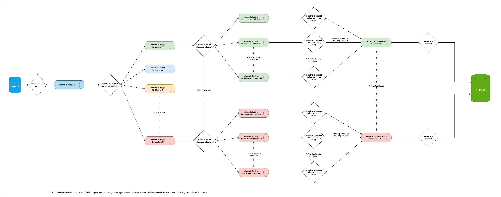

# Mongo-oplog-to-sql

## Problem Statement
The content in this repository serves as a reference implementation for the problem statement available at https://playbook.one2n.in/mongodb-oplog-to-sql-parser-exercise.

> There are solutions that are able to store the JSON document in a relational table using PostgreSQL JSON support, but it doesn't solve the real problem of 'how to really use that data'. The system enables parsing of data in MongoDB's oplog and translating it to equivalent SQL statements.

The MongoDB oplog (operation log) is a capped collection that records all write operations that modify data within a MongoDB replica set, allowing for replication and providing a basis for high availability and data recovery.

This is a command-line utility written in Go that allows you to parse MongoDB's oplog and translate it into equivalent SQL statements. This tool is designed to facilitate seamless migration of data from MongoDB to a SQL-based database system while preserving data integrity and structure. By automating the migration process, MongoOplogToSQL saves you time and effort.

## High-Level Design (HLD)

This parser is designed to efficiently parse the MongoDB oplog and synchronize data to a PostgreSQL database. Here's an overview of the steps performed by the parser:

1. Read Oplogs from MongoDB: A goroutine continuously reads the oplogs from the running MongoDB instance and puts them into a channel. This allows for real-time streaming of changes from MongoDB.

2. Fan-out Oplogs per Database: Another goroutine reads oplogs from the channel and fans them out into multiple channels, one channel per database. At this step, the parser also creates a separate SQL channel for each database to put the generated SQL statements in the subsequent step (Step 4).

3. Fan-out Oplogs per Collection: Separate goroutines read oplogs from the database channels and fan them out into multiple channels, one channel per collection. This step helps segregate the data based on collections.

4. Convert Oplogs to SQL Statements: Additional goroutines read oplogs from the collection channels, convert them into SQL statements, and post the SQL statements to the SQL channels created in step 2. This conversion ensures that the data is ready for ingestion into PostgreSQL.

5. Execute SQL Statements: In the main goroutine, SQL statements are read from the SQL channels created in step 2. Separate goroutines are used for each SQL channel per database to execute the SQL statements on the running PostgreSQL instance. This step finalizes the synchronization of data from MongoDB to PostgreSQL.

By using goroutines and channels, the parser can effectively handle the high volume of data while ensuring data integrity and achieving concurrency, making the synchronization process efficient and scalable.

## Features
- Parses MongoDB's oplog data
- Translates oplog data into SQL statements
- Supports migration from MongoDB to SQL-based database systems
- Preserves data integrity and structure during migration

## Installation

To install and set up the Mongo-oplog-to-sql tool, follow the steps below:

### Prerequisites

1. Docker: Ensure that Docker is installed and running on your local machine. If you don't have Docker installed, refer to the [Docker documentation](https://docs.docker.com/engine/install/) for instructions.

### Quickstart

1. Mongo Cluster

   - If you already have a running Mongo cluster, update the details in the `.env` file based on the provided `.env.example` file.
   - If you don't have a Mongo cluster set up, you can follow the instructions in the [mongo-oplog-populator](https://github.com/one2nc/mongo-oplog-populator) repository to set up a cluster and populate data.

2. Postgres SQL

   - If you have a running PostgreSQL instance, update the details in the `.env` file based on the provided `.env.example` file.
   - If you don't have PostgreSQL running locally, you can follow the setup instructions provided in this  readme.

### Development Setup

To set up the development environment, follow these steps:

1. Create a `.env` file and add the required configurations as provided in the `.env.example` file.

2. Run `make setup` to set up PostgreSQL.

3. Build the binary using `make build`.

4. Run the binary `./MongoOplogToSQL` along with the following flags:

   - `-f`: Specify the location of the Mongo-oplog file from which to read the oplogs. If this option is not provided, the application reads the oplogs from the Mongo client.
   - `-o`: Specify the location of the output file where you want to write all the generated SQL commands. If this option is not provided, the SQL statements generated will be executed on the PostgreSQL database.
   - If `-f` is not provided, the tool will read the data from the Mongo database.
   - If `-o` is not provided, the tool will execute the generated SQL statements on the PostgreSQL database.

5. To connect to the PostgreSQL running on Docker, use `make connect`.

6. To tear down PostgreSQL, use `make setup-down`.

## Open Issues/Cases Not Handled

1. **Bookmarking Support:** This implementation does not support bookmarking, which means that the parser may process duplicate oplogs upon restart. 

2. **Distributed Execution:** Running the parser on multiple machines in a distributed manner is not yet supported. Users should be cautious about handling duplicate data and manage their deployment accordingly. 

3. **Handling Updates and Deletions in Foreign Tables:** This implementation does not address updates and deletions of records in the foreign tables or associated tables. When using the parser, please be aware that changes in related tables may not be reflected in the SQL output.

## License
This project is licensed under the [MIT License](./LICENSE)