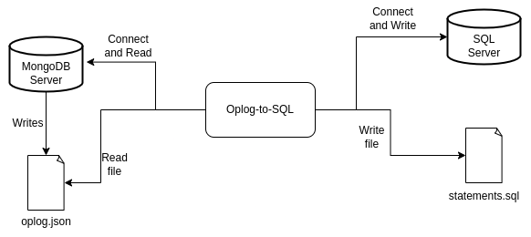

# Mongo-oplog-to-sql

This repository serves as a reference implementation for the problem statement described [here](https://playbook.one2n.in/mongodb-oplog-to-sql-parser-exercise).

> There are solutions that are able to store the JSON document in a relational table using PostgreSQL JSON support, but it doesn't solve the real problem of 'how to really use that data'. The system enables parsing of data in MongoDB's oplog and translating it to equivalent SQL statements.

The MongoDB oplog (operation log) is a capped collection that records all write operations that modify data within a MongoDB replica set, allowing for replication and providing a basis for high availability and data recovery.

## Installation

To install and set up the Mongo-oplog-to-sql tool, follow the steps below:

### Prerequisites

1. Docker: Ensure that Docker is installed and running on your local machine. If you don't have Docker installed, refer to the [Docker documentation](https://docs.docker.com/engine/install/) for instructions.

### Quickstart

1. Mongo Cluster

   - If you already have a running Mongo cluster, update the details in the `.env` file based on the provided `.env.example` file.
   - If you don't have a Mongo cluster set up, you can follow the instructions in the [mongo-oplog-populator](https://github.com/one2nc/mongo-oplog-populator) repository to set up a cluster and populate data.

2. Postgres SQL

   - If you have a running PostgreSQL instance, update the details in the `.env` file based on the provided `.env.example` file.
   - If you don't have PostgreSQL running locally, you can follow the setup instructions provided in this  readme.

### Development Setup

To set up the development environment, follow these steps:

1. Create a `.env` file and add the required configurations as provided in the `.env.example` file.

2. Run `make setup` to set up PostgreSQL.

3. Build the binary using `make build`.

4. Run the binary `./MongoOplogToSQL` along with the following flags:

   - `-f`: Specify the location of the Mongo-oplog file from which to read the oplogs. If this option is not provided, the application reads the oplogs from the Mongo client.
   - `-o`: Specify the location of the output file where you want to write all the generated SQL commands. If this option is not provided, the SQL statements generated will be executed on the PostgreSQL database.
   - If `-f` is not provided, the tool will read the data from the Mongo database.
   - If `-o` is not provided, the tool will execute the generated SQL statements on the PostgreSQL database.

5. To connect to the PostgreSQL running on Docker, use `make connect`.

6. To tear down PostgreSQL, use `make setup-down`.

### Open Issues/Cases Not Handled

1. Updating records in foreign tables or associated tables.

2. Deletion of records in foreign tables or associated tables.
