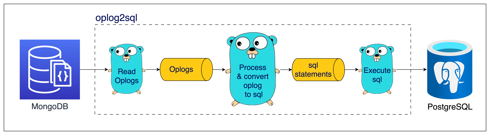
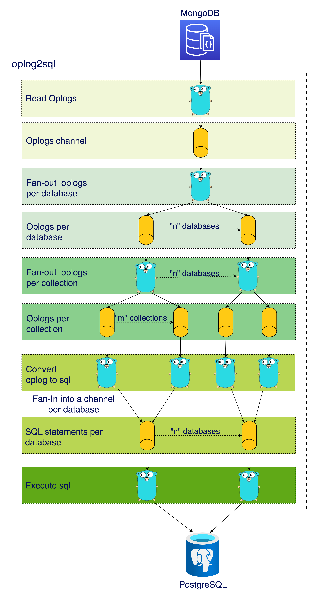

# Mongo-oplog-to-sql

This repository is a reference implementation of the problem statement available at https://playbook.one2n.in/mongodb-oplog-to-sql-parser-exercise. The solution is a command-line utility that allows you to migrate data from MongoDB to an RDBMS.

We have a scenario where an organization used MongoDB initially but now needs to move to an RDBMS database. This data transition can be made easy if we can convert the JSON documents in MongoDB collections to equivalent rows in relational DB tables. That's the purpose of this program.

This repo contains story-wise implementation using Test Driven Development for all stories in the problem statement. Refer to the tags in the repo for the implementation and tests for individual stories.

The overall flow of the solution is given below:

- Sequentially read oplogs from MongoDB.
- Parse the oplogs and convert them into SQL statements.
- Execute these SQL statements against an RDBMS (PostgreSQL in our case)

There are two types of implementations for the problem statement.
1. A serial implementation where there's a single goroutine that processes one oplog at a time 
2. A multi-goroutine implementation where multiple goroutines process the oplogs for each database-collection concurrently.

Here's what the serial implementation looks like.

In MongoDB, there are multiple databases, and each database has multiple collections. We can create a goroutine for every database-collection combination and perform the logic of parsing the oplog and converting it into SQL in that goroutine. Theoretically, this should make the program parallel and result in some performance gains.

This is what a multi-goroutine implementation looks like. It uses a fan-out pattern to create a goroutine for every database-collection combination. If there are `n` databases and `m` collections per database, there will be `m*n` number of goroutines running concurrently. 

### Demo
https://github.com/one2nc/mongo-oplog-to-sql/assets/9951874/b98ec69f-df36-4239-86e3-f8942801a714

### Development Setup

To set up the development environment, follow these steps:

1. Create a `.env` file and add the required configurations as provided in the `.env.example` file.

2. Run `make setup` to set up PostgreSQL.

3. Build the binary using `make build`.

4. To populate the data in MongoDB, you need to setup it by following the setup instructions in this companion repo [mongo-oplog-populator](https://github.com/one2nc/mongo-oplog-populator).

5. Run the binary `./oplog2sql`, this will connect to MongoDB and PostgreSQL as per configuration mentioned in the `.env` file.

## Open Issues/Cases Not Handled

This solution is not production ready. To keep things simple, the following features are not implemented.

1. **Bookmarking Support:** This implementation does not support bookmarking, which means that the parser may process duplicate oplogs upon restart. 

2. **Distributed Execution:** Running the parser on multiple machines in a distributed manner is not yet supported. Users should be cautious about handling duplicate data and manage their deployment accordingly. 

3. **Handling Updates and Deletions in Foreign Tables:** This implementation does not address updates and deletions of records in the foreign tables or associated tables. When using the parser, please be aware that changes in related tables may not be reflected in the SQL output.

## License
This project is licensed under the [MIT License](./LICENSE)
